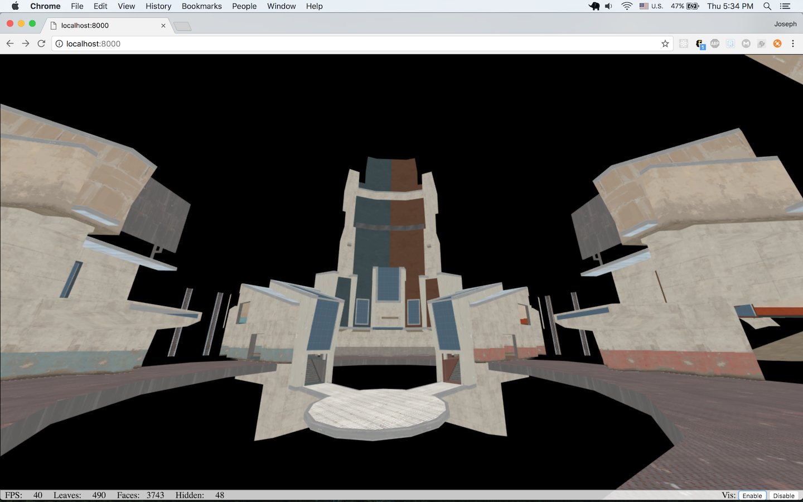

## Project Description

This project loads a .BSP map file for the Source Engine (the engine used for games like Team Fortress 2, Half-Life 2, and CS:GO) and renders the static geometry with textures and various types of face culling. It also implements a free-look camera to allow the user to explore the geometry.

The project runs in the web browser with no plugins, utilizing WebGL for rendering. It builds upon previous work I have done to develop a web-based 3D multiplayer game engine.

## Graphics Technologies

### Free Look Camera

I implemented a free look camera in a fashion similar to our previous projects. Pitch and yaw are tracked and modified in response to mouse movement, and these values are used in the generation of a lookAt view matrix. The basis vectors for the camera are extracted from the camera matrix and used to translate the camera position when the user presses ASDW.

### Texturing

My initial hope was to support Source Engine material (VMT) and texture (VTF) files directly. However, there were some major technical constraints that prevented me from doing this within our timeline for the project. VMT files are a text format with a variety of odd features, and VTF files are in a proprietary format that is not documented publicly. I was able to find some crusty, unsupported Javascript libraries with partial support for VTF files, but they were not entirely suitable. Another roadblock was texture compression: textures used in games are almost universally compressed with one of a variety of compression algorithms know as DXT*. Support for these formats in WebGL utility libraries is spotty, and the libraries I am using have poor support for them.

To go around these issues, I chose to use a utility to extract textures for the map I am testing with, and convert then to PNG images. These images are stored in a dictionary addressed by the path used in the BSP file to reference them.

In the future I hope to implement a VMT parser and use texture data directly from the VTFs. This will also be important for the addition of lighting.

### Culling

Visibility culling is the process of determining what elements of a scene are not visible and skipping them during rendering. Performing culling is very complex, and doing it perfectly is usually not worthwhile. In order to determine every face that is visible, you have to cast rays from the camera position into the scene, which is very computationally expensive. There are low hanging fruit, however. If all geometry is closed, we know that any face that is pointing away from the camera is not visible - removing these is called backface culling. We can also check whether our geometry is within our viewing frustum. If we use axis-aligned bounding boxes for this check, it is very cheap and this eliminates a ton of geometry.

#### VIS Culling

Visibility culling beyond these methods is a very difficult problem. Because of the computational complexity involved, the Source Engine performs this analysis during map compilation, and stores information about what is visible from where inside the BSP file.

Source Engine maps are fully closed. This means that there is an internal area that players can move around in, and no openings out to the 'void'. This internal area of the map is divided into small volumes called leaves. When the map is being compiled, the lighting tool determines what other leaves are visible from each leaf. It then stores this information in an array of bitfields in the BSP. To save space, the zeroes in the bitfield are run-length encoded, so a byte of 0 indicates that the next byte specifies how many 0 bytes should follow.

During rendering, we use the [BSP tree structure](https://en.wikipedia.org/wiki/Binary_space_partitioning) to determine what leaf the camera is in, and then use the visibility array to check which other leaves to render.

#### Backface Culling

Backface culling is the process of removing / ignoring any faces of scene geometry that are facing away from the camera. For example, if I draw an opaque cube on the screen, only the sides facing me are visible. If we draw the sides that are on the other side of the cube, we are wasting time!

The standard method for defining the direction a face is pointing is based on *winding*. This is the same concept that we used in calculating barycentric coordinates in our software renderer. In that project, we specified triangles in a counter-clockwise (CCW) fashion. We could tell if a point was outside of the triangle because we would get a negative value when computing the areas of the subtriangles. If we looked at the triangles from the other side, the winding would be flipped.

In this project, I chose to perform backface culling on the GPU. Interestingly, the Source Engine appears to specify geometry using a clockwise (CW) winding.

#### Frustum Culling

Unfortunately I did not have time to implement frustum culling for this project. That's probably the first thing on the TODO list.

## Screenshots

Middle of map with VIS disabled:

Middle of map with VIS enabled:

Note that various surfaces that should be visible are not rendered when VIS is enabled. These surfaces use displacement mapping, which is not yet supported in this project. Such surfaces require special handling in VIS, and these features of the Source Engine are not well documented.

Enclosed space with VIS disabled

Enclosed space with VIS enabled

Note the performance difference in an enclosed space. Without VIS culling, all faces in the map are rendered, bringing the FPS down to around 35. With VIS culling in a location without line-of-site to much of the map, far fewer faces are rendered, allowing the FPS to cap out at 60.
